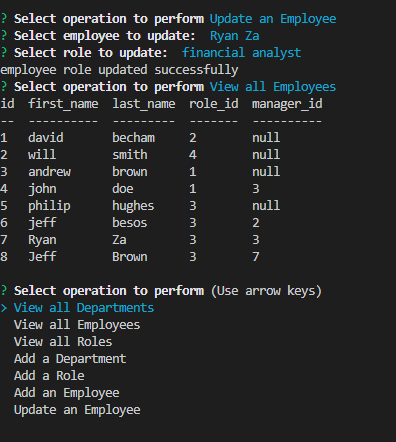

# Challange 12 MYSQL

The challenge required students to create a database and seed it. It also required them to use inquier to promt the user with different choices to view, add and update the database.

The file consists of a database, schema and seeds sql file, a demo video, package.json and a server.js file.

Contents: Inquirer, MySql, Javascript

This file does not contain a link however can be viewed on [GitHub](https://github.com/RyanZade)

Please find attached a snippet screenshot of Challenge 17

My GitHub: [RyanZade](https://github.com/RyanZade)
